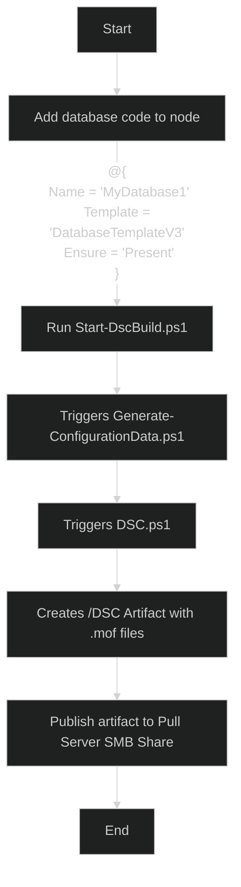

# Introduction 
# DscTemplated
PowerShell Desired State Configuration (DSC) framework that uses templates to define resources. This is currently a Proof of Concept (PoC) and was first created to automatically deploy databases with dependencies.

# Goals of this repository
This PoC wants to achieve below goals:
1. Create resources with the least amount of work required by "end users"
    1. Define templates for reusing code
2. Do not use Credentials / Certificates for DSC
3. Automate the deployment to the nodes

# Getting Started
1.  Import DSC modules and save the resources \
    Run this on your dev machine one time to install prerequisites. Run this in your pipeline everytime to publish the latest Dsc resouces.
    ```powershell
    .\Install-Requirements.ps1 -Environment $Environment
    ```
2. Build Dsc mof files \
    This is the main script that creates .mof files and their checksums. The DSC folder is the artifact to be published to a Dsc Pull SMB share.
    ```powershell
    .\Start-DscBuild.ps1 -Environment $Environment
    ```
3. Publish "/$environment/DSC" folder to your Pull Server or use it with manually with Start-DscConfiguration

# Roadmap
- Publish Script to onboard nodes to a pull server
- provide pipeline examples
- Add support for additional resource types
- Create detailed documentation and examples
- Implement Pester tests

# Disclaimer
This is my first PowerShell DSC project. Use it carefully and on your own responsibility. It can automatically create AND delete resources. \
I am open to suggestions. Maybe this approach is not the best, but it helped me learn more about PowerShell DSC, Azure Pipelines, Markdown, etc.

# Workflow Example


# Code Snippets
Other information related to DSC.

```Powershell
# Install required modules
Install-Module PsDesiredStateConfiguration,SqlServerDsc,ActiveDirectoryDsc,DnsServerDsc -Repository PSGallery
# Check for Dsc resources
Get-DscResource -Module ActiveDirectoryDsc
# Push Dsc configuration from folder
Start-DscConfiguration .\DSC -Wait -Verbose
# Push Dsc configuration from current pull config
Start-DscConfiguration -UseExisting -Wait -Verbose
# Test Config
Test-DSCConfiguration
# To force fetching and applying Dsc config from pull server
Update-DscConfiguration -Wait -Verbose
```
# Get GUID
For an SMB Pull Server you need a GUID. I use the Active Directory GUID of the Computer Object. I prepare the node with another PowerShell Script: "Update-PowerShellDscLcm" \
\
You can also generate a GUID and set it on the node.

```Powershell
$NewGuid = [guid]::NewGuid().ToString()
```